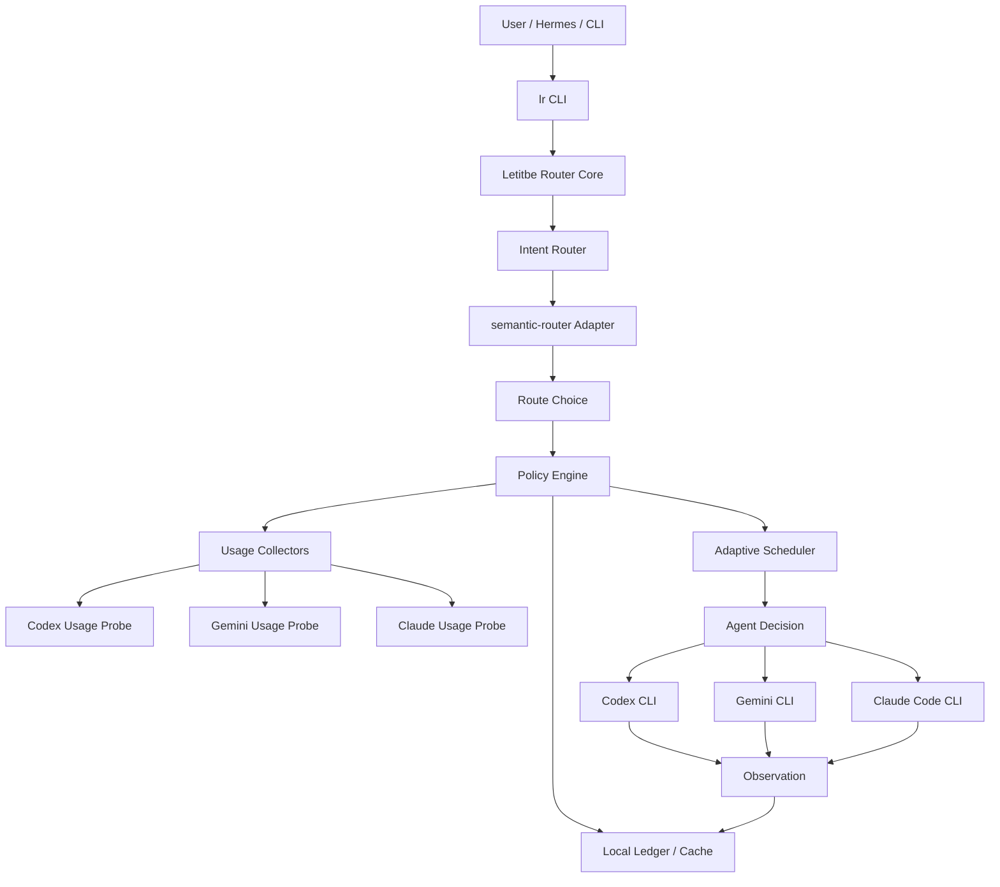

# Letitbe Router Architecture

Letitbe Router is a thin, local-first orchestration layer that separates intent classification from adaptive agent selection.

## Layer model



## Responsibilities

### CLI layer

Commands planned for the MVP:

- `lr route TEXT`: semantic route only
- `lr usage`: collect or read cached usage signals
- `lr decide TEXT`: route + usage-aware agent decision
- `lr status`: agent health/cooldown summary
- `lr smoke`: local deterministic health check

### Intent router

The intent router answers:

> What kind of work is this?

It delegates semantic matching to `semantic-router`, but normalizes results into Letitbe Router's own domain objects.

### semantic-router adapter

Only this adapter imports upstream `semantic_router`.

Public Letitbe Router code should not depend on:

- `BaseRouter` internals
- underscore/private methods
- upstream hash/sync internals
- upstream config format as a permanent storage contract

Recommended dependency policy for the first implementation:

```text
semantic-router>=0.1.12,<0.2
```

Version checks should use package metadata:

```python
from importlib.metadata import version
version("semantic-router")
```

Do not rely on `semantic_router.__version__`, because the inspected upstream package had a metadata/version mismatch.

### Policy engine

The policy engine combines:

- semantic route fit
- configured agent affinity
- observed usage windows
- cooldown state
- recent failures
- optional cost/quality weights

### Scheduler

The scheduler should start as a deterministic scoring scheduler, then evolve toward deficit weighted round-robin plus token/usage buckets.

Initial score shape:

```text
score =
  route_fit
  * agent_affinity
  * available_capacity
  * health_score
  * freshness_score
  * quality_weight
  * cost_weight
  - cooldown_penalty
  - recent_error_penalty
```

### Usage collectors

Usage collectors produce normalized usage windows. They should never expose raw credentials in logs or output.

The first collectors are:

- Codex CLI
- Gemini CLI
- Claude Code CLI

Collectors must mark every signal with source and confidence.

## Config layout

Planned default paths:

```text
~/.config/letitbe-router/config.yaml
~/.local/share/letitbe-router/router.db
~/.cache/letitbe-router/usage.json
```

Example config shape:

```yaml
router:
  backend: semantic-router
  semantic_router_version_policy: ">=0.1.12,<0.2"

routes:
  code_worker:
    utterances:
      - fix failing tests
      - implement feature
      - refactor code
    candidates:
      - codex-cli
      - claude-code
      - gemini-cli

  research:
    utterances:
      - compare documentation
      - research options
      - summarize repo
    candidates:
      - gemini-cli
      - claude-code
      - codex-cli

  review:
    utterances:
      - review architecture
      - identify risks
      - critique this plan
    candidates:
      - claude-code
      - gemini-cli
      - codex-cli

agents:
  codex-cli:
    kind: cli
    command: ["codex"]
    usage_provider: codex
    quality_weight: 0.9
    cost_weight: 0.7

  gemini-cli:
    kind: cli
    command: ["gemini"]
    usage_provider: gemini
    quality_weight: 0.75
    cost_weight: 0.9

  claude-code:
    kind: cli
    command: ["claude"]
    usage_provider: claude
    quality_weight: 0.95
    cost_weight: 0.6
```

## Non-goals for MVP

- No browser dashboard.
- No MITM proxy.
- No broad process killing.
- No hidden global dependency installation.
- No claim of exact quota remaining when only usage percentages are observable.
